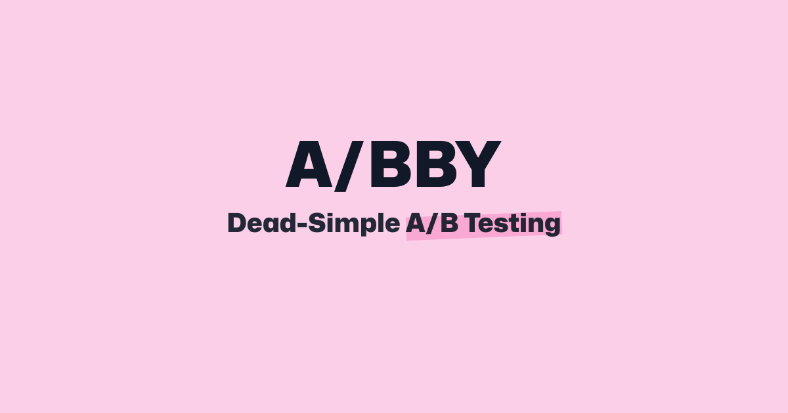

# About Abby

Abby is a open source feature management and A/B testing platform. It is designed to be easy to use and easy to integrate into your existing applications. It aims to improve the developer experience by providing a simple and statically typed API for feature management and A/B testing.

Besides its official SDKS it also offers a friendly and easy to understand Dashboard for the non-developers in your team.

Abby focuses on privacy. This means it won't track any user data and uses no marketing cookies. It also doesn't use any third party services.
You can self host it or use the hosted version available at [tryabby.com](https://www.tryabby.com).

## Getting Started

_TL;DR:_

```
git clone git@github.com:tryabby/abby.git
pnpm i
pnpm db:start
pnpm db:migrate
cp apps/web/.env.example apps/web/.env
pnpm dev
```

Now open your browser at http://localhost:3000 and have fun :)

## What's inside?

This turborepo uses [pnpm](https://pnpm.io) as a package manager. It includes the following packages/apps:

### Apps and Packages

- `docs`: a [Next.js](https://nextjs.org/) with [Nextra](https://nextra.site/)
- `web`: another [Next.js](https://nextjs.org/) app using the [T3 Stack](https://create.t3.gg/)
- `core`: The Abby core JavaScript SDK which all other JS SDKs are based on
- `react`: The Abby React SDK
- `next`: The Abby Next.js SDK
- `angular`: The Abby Angular SDK
- `svelte`: The Abby Svelte SDK

Each package/app is 100% [TypeScript](https://www.typescriptlang.org/).

### Utilities

This turborepo has some additional tools already setup for you:

- [TypeScript](https://www.typescriptlang.org/) for static type checking
- [ESLint](https://eslint.org/) for code linting
- [Prettier](https://prettier.io) for code formatting

## Useful Links

Learn more about the power of Turborepo:

- [Pipelines](https://turbo.build/repo/docs/core-concepts/monorepos/running-tasks)
- [Caching](https://turbo.build/repo/docs/core-concepts/caching)
- [Remote Caching](https://turbo.build/repo/docs/core-concepts/remote-caching)
- [Filtering](https://turbo.build/repo/docs/core-concepts/monorepos/filtering)
- [Configuration Options](https://turbo.build/repo/docs/reference/configuration)
- [CLI Usage](https://turbo.build/repo/docs/reference/command-line-reference)
